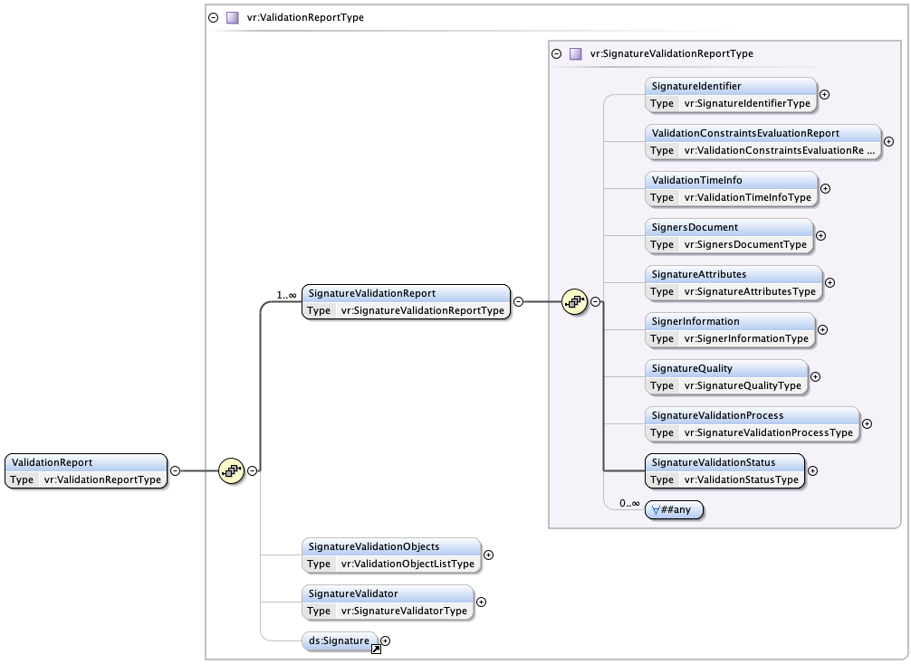

# Signature validation report

----

This module provides an implementation of the ETSI TS 119 102-2 signature validation report

## Report structure

The following XML schema files are compiled in support of producing this report (located in src/main/schema):

- [ETSI TS 119 102-2 schema](src/main/schema/TS119102-2-v131_fixed.xsd)
- [RFC 7773 Authentication context extension schema](src/main/schema/CertAuthContextExtension-SAML-1.0.xsd)

The validation report follows the following basic structure:

The ValidationReport element holds information about one or more signatures of a signed document. Each signature is represented by
a SignatureValidationReport element.

The Validation report element holds the following common elements supporting all signatures in the report:

- SignatureValidationObjects - Holding information about objects that are used to validate the signatures
- SignatureValidator - Information about the issue of the report
- Signature - And XML signature over the report itself

Note: This implementation does currently not implement the SignatureValidator options as it is duplicated by the Signature element. This
implementation therefore favours the option to sign the report and let the signature certificate carry information about the issuer.

### SignatureValidationObjects

Signature validation objects holds information about objects that has been used to validate the signature. The SignatureValidationReport elements
contain references to objects stored here rather than including the objects.

The following types of signature validation objects are handled by this implementation:

- Certificates used to validate signatures and timestamps
- Timestamps used to establish POE (Proof Of Existence) times
- Other evidence of time
- Data that has been signed by reported signatures

Referenced data can be included as the full object (Base64 encoded) or a hash of the object. Certificates are allways included as the full object
and timestamps are always included as a hashed representation of the object.

This implementation provides options whether the generated report should include:

- Timestamp certificates should be included
- The full signature chain of certificate (or just the signer certificate)
- whether signed data should be included as a hash or the full data representation.

### SignatureValidationReport

This element contains information about each signature. The following child element are supported:

| Child element              | Usage                                                                                                        |
|----------------------------|--------------------------------------------------------------------------------------------------------------|
| SignatureIdentifier        | Holds identification data to bind this element to a signature.                                               |
| ValidationTimeInfo         | Information when the report was created and the best POE for this signature                                  |
| SignersDocument            | Reference to the data that was signed by this signature                                                      |
| SignatureAttributes        | Specific information about this signature                                                                    |
| SignatureQuality           | The overall quality of this signature (non, advanced signature, qualified certificate or qualified signature |
| SignatureValidationProcess | An identifier of the process used to validate the signature                                                  |
| SignatureValidationStatus  | The status (outcome) of the signature validation process                                                     |

The SignatureAttributes element holds all specific information about each signature. This implementation supports a sub-set of all present elements
specified in the ETSI standard that are relevant for the type of signature validation process handled by this library. In addition to this, some
elements are added in addition to the ETSI standard elements.

The following SignatureElements are supported and included if applicable:

| Element            | Usage                                                                                                                                                      |
|--------------------|------------------------------------------------------------------------------------------------------------------------------------------------------------|
| Signing time       | Holds any claimed signing time from the signature if present                                                                                               |
| DataObjectFormat   | Data format for this signature type                                                                                                                        |
| SigningCertificate | A reference to the signing certificate                                                                                                                     |
| SignatureTimestamp | Reference to one or more timestamps supporting the POE of this signature                                                                                   |
| SignatureMethod    | This is a non ETSI standard amendment and includes information about the signature algorithm using this element from the XML digital signature XML schema. |
| SAMLAuthContext    | Includes the authentication context data from the signer certificate if present using the format specified in RFC 7773.                                    |

Note: DataObjectFormat refer to the signature data format rather than the signed data format. In case of PDF and XML, signature
format and data format is the same but in other signature formats such as JOSE, the signed data may be using any data format.
